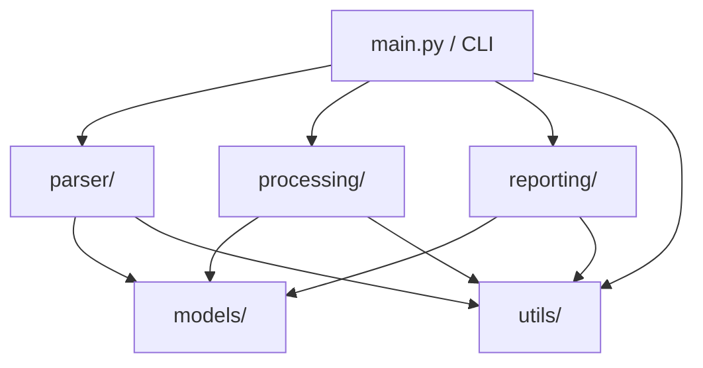

# IRCTC Train Ticket PDF Analyzer — Implementation Plan

## Overview

Build a production-quality Python CLI application that reads IRCTC train ticket PDFs from a directory, extracts structured data, stores it in a custom linked list, sorts chronologically, and generates Excel reports, timeline visualizations, and PDF reports.

## Architecture

**Data Flow:**
1. `main.py` reads CLI args → discovers PDFs in input dir
2. `parser/` extracts text from each PDF → parses fields via regex → creates `Ticket` + `Passenger` dataclasses
3. Each ticket is appended to a `LinkedList` (from `models/linked_list.py`)
4. `processing/sorter.py` sorts the linked list by `departure_datetime` using **merge sort**
5. `processing/journey_aggregator.py` groups journeys by passenger name
6. `reporting/` generates Excel, timeline PNG, and PDF report
7. Errors are logged to file + console; execution never stops

---

