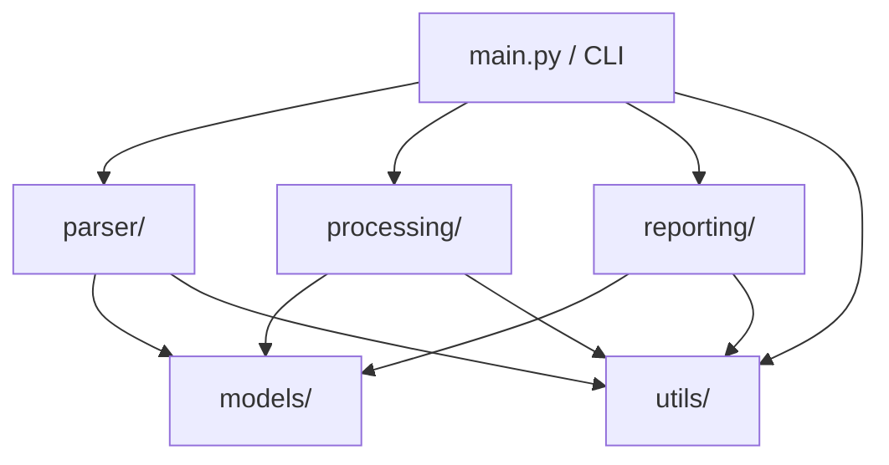

# IRCTC Train Ticket PDF Analyzer — Implementation Plan

## Overview

Build a production-quality Python CLI application that reads IRCTC train ticket PDFs from a directory, extracts structured data, stores it in a custom linked list, sorts chronologically, and generates Excel reports, timeline visualizations, and PDF reports.

## Architecture



**Data Flow:**
1. `main.py` reads CLI args → discovers PDFs in input dir
2. `parser/` extracts text from each PDF → parses fields via regex → creates `Ticket` + `Passenger` dataclasses
3. Each ticket is appended to a `LinkedList` (from `models/linked_list.py`)
4. `processing/sorter.py` sorts the linked list by `departure_datetime` using **merge sort**
5. `processing/journey_aggregator.py` groups journeys by passenger name
6. `reporting/` generates Excel, timeline PNG, and PDF report
7. Errors are logged to file + console; execution never stops

---

## Proposed Changes

### Models (`models/`)

#### [NEW] [\_\_init\_\_.py](file:///c:/projects/train_ticket/models/__init__.py)
Package init, re-exports `Ticket`, `Passenger`, `LinkedList`.

#### [NEW] [passenger.py](file:///c:/projects/train_ticket/models/passenger.py)
`@dataclass` with fields: `name`, `age`, `gender`, `booking_status`, `current_status`, `coach`, `seat_number`, `berth`. All `Optional[str]` except `name`.

#### [NEW] [ticket.py](file:///c:/projects/train_ticket/models/ticket.py)
`@dataclass` with all required fields (`pnr`, `train_number`, `train_name`, `from_station`, `to_station`, `departure_datetime`, `arrival_datetime`, `booking_datetime`, `travel_class`, `quota`, `distance`, `transaction_id`, `ticket_fare`, `convenience_fee`, `insurance_fee`, `total_fare`, `invoice_number`, `gstin`, `sac_code`, `passengers`, `file_name`). All fields default to `None` except `passengers: List[Passenger] = field(default_factory=list)` and `file_name: str`.

#### [NEW] [linked_list.py](file:///c:/projects/train_ticket/models/linked_list.py)
- `Node` class: `data: Ticket`, `next: Optional[Node]`
- `LinkedList` class with methods:
  - `append(ticket)` — O(1) tail append
  - `insert(index, ticket)` — insert at position
  - `traverse()` — generator yielding each node's data
  - `to_list()` — returns `List[Ticket]`
  - `sort_by_departure_datetime()` — **merge sort** on linked list (O(n log n))
  - `__len__()`, `__iter__()`
- Merge sort implementation splits list at midpoint using slow/fast pointer, recursively sorts halves, merges by comparing `departure_datetime`.

---

### Parser (`parser/`)

#### [NEW] [\_\_init\_\_.py](file:///c:/projects/train_ticket/parser/__init__.py)

#### [NEW] [regex_patterns.py](file:///c:/projects/train_ticket/parser/regex_patterns.py)
Centralized compiled regex patterns for all fields:
- `PNR_PATTERN` — `r'PNR\s*(?:No\.?|Number)?\s*:?\s*(\d{10})'`
- `TRAIN_NO_PATTERN` — `r'Train\s*(?:No\.?|Number)?\s*:?\s*(\d{4,5})'`
- `TRAIN_NAME_PATTERN` — `r'Train\s*Name\s*:?\s*(.+)'`
- Station patterns (From/To with station codes)
- Date/time patterns (multiple Indian date formats: `dd-Mon-yyyy HH:MM`, `dd/mm/yyyy`, etc.)
- Fare patterns (₹ or Rs. prefixed amounts)
- Passenger block patterns
- GST patterns (GSTIN, SAC, Invoice)
- Transaction ID, Quota, Class, Distance patterns

#### [NEW] [text_extractor.py](file:///c:/projects/train_ticket/parser/text_extractor.py)
- `extract_text_from_pdf(pdf_path: Path) -> str` — uses `pdfplumber` as primary, falls back to `PyMuPDF` (`fitz`) if pdfplumber fails or returns empty text.
- Concatenates text from all pages.

#### [NEW] [pdf_parser.py](file:///c:/projects/train_ticket/parser/pdf_parser.py)
- `parse_ticket(pdf_path: Path) -> Ticket` — orchestrates extraction:
  1. Calls `extract_text_from_pdf()`
  2. Applies regex patterns to extract each field
  3. Parses dates into `datetime` objects with multiple format fallbacks
  4. Extracts passenger blocks → creates `Passenger` objects
  5. Returns populated `Ticket` dataclass
- `parse_all_tickets(input_dir: Path) -> LinkedList` — iterates over `*.pdf` files, calls `parse_ticket()`, appends to linked list, catches and logs exceptions per file.

---

### Processing (`processing/`)

#### [NEW] [\_\_init\_\_.py](file:///c:/projects/train_ticket/processing/__init__.py)

#### [NEW] [sorter.py](file:///c:/projects/train_ticket/processing/sorter.py)
- `sort_tickets(linked_list: LinkedList) -> LinkedList` — calls `linked_list.sort_by_departure_datetime()`.
- Tickets with `None` departure are sorted to the end.

#### [NEW] [journey_aggregator.py](file:///c:/projects/train_ticket/processing/journey_aggregator.py)
- `aggregate_by_passenger(tickets: List[Ticket]) -> Dict[str, List[dict]]` — groups journeys by passenger name across all tickets. Each entry contains train info, PNR, departure, route, seat/status.

---

### Reporting (`reporting/`)

#### [NEW] [\_\_init\_\_.py](file:///c:/projects/train_ticket/reporting/__init__.py)

#### [NEW] [excel_generator.py](file:///c:/projects/train_ticket/reporting/excel_generator.py)
- `generate_excel(tickets: List[Ticket], passenger_journeys: Dict, output_path: Path) -> None`
- **Sheet 1 — "All Tickets"**: One row per ticket. Passenger names comma-joined, seats comma-joined, coaches comma-joined. All 25+ columns as specified.
- **Sheet 2 — "Passenger Journey Summary"**: One row per (passenger, journey) pair. Grouped by passenger, sorted chronologically within each group.
- Uses `pandas` + `openpyxl` for styling (header formatting, column widths, alternating row colors).

#### [NEW] [visualization.py](file:///c:/projects/train_ticket/reporting/visualization.py)
- `generate_timeline(tickets: List[Ticket], output_path: Path) -> None`
- Uses `plotly` to create a horizontal timeline/Gantt-style chart.
- X-axis: departure dates. Y-axis: journey entries.
- Each bar labeled with passenger names + route (From → To).
- Professional color scheme, proper legends, annotations.
- Exports as high-resolution PNG via `kaleido`.

#### [NEW] [pdf_report_generator.py](file:///c:/projects/train_ticket/reporting/pdf_report_generator.py)
- `generate_pdf_report(tickets: List[Ticket], passenger_journeys: Dict, timeline_path: Path, output_path: Path) -> None`
- Uses `reportlab` with `SimpleDocTemplate`.
- **Section 1**: Executive Summary — total tickets, total journeys, unique passengers, date range.
- **Section 2**: All Tickets Table (paginated with `Table` and `TableStyle`).
- **Section 3**: Passenger Journey Summaries.
- **Section 4**: Embedded timeline image.
- Professional styling: custom colors, headers, spacing, page numbers.

---

### Utils (`utils/`)

#### [NEW] [\_\_init\_\_.py](file:///c:/projects/train_ticket/utils/__init__.py)

#### [NEW] [logger.py](file:///c:/projects/train_ticket/utils/logger.py)
- Configures root logger with two handlers:
  - `StreamHandler` (console, INFO level)
  - `FileHandler` (error_log.txt, WARNING level, detailed format with timestamp)
- `setup_logger(output_dir: Path, verbose: bool) -> logging.Logger`

#### [NEW] [helpers.py](file:///c:/projects/train_ticket/utils/helpers.py)
- `safe_parse_date(text: str) -> Optional[datetime]` — tries multiple Indian date formats
- `safe_parse_float(text: str) -> Optional[float]` — strips ₹/Rs, commas
- `clean_text(text: str) -> str` — normalizes whitespace, strips artifacts
- `ensure_dir(path: Path) -> None`

#### [NEW] [constants.py](file:///c:/projects/train_ticket/utils/constants.py)
- Date format strings
- Default output filenames
- Application metadata (name, version)

---

### Root Files

#### [NEW] [main.py](file:///c:/projects/train_ticket/main.py)
- CLI entry point using `argparse`
- Arguments: `--input`, `--output`, `--excel-only`, `--pdf-only`, `--timeline-only`, `--verbose`
- Orchestrates: setup logger → parse all → sort → aggregate → generate reports
- Prints summary to console on completion

#### [NEW] [requirements.txt](file:///c:/projects/train_ticket/requirements.txt)
```
pdfplumber>=0.10.0
PyMuPDF>=1.23.0
pandas>=2.0.0
openpyxl>=3.1.0
plotly>=5.18.0
kaleido>=0.2.1
reportlab>=4.0.0
```

#### [NEW] [README.md](file:///c:/projects/train_ticket/README.md)
Installation, usage, architecture overview, sample commands.

---

## Open Questions

> [!IMPORTANT]
> **Sample PDFs**: Do you have sample IRCTC ticket PDFs available in `c:\projects\train_ticket\input\pdfs\`? I'll need at least one to validate and refine the regex patterns. If not, I'll build the parser based on the example text you provided and common IRCTC formats — you can fine-tune later.

> [!NOTE]
> **Plotly PNG Export**: Exporting Plotly charts to PNG requires the `kaleido` package. This is included in requirements.txt. If you prefer an interactive HTML export instead of/in addition to PNG, let me know.

---

## Verification Plan

### Automated Tests
- Run `python main.py --input ./input/pdfs --output ./output --verbose` and verify:
  - No crashes even with missing/corrupt PDFs
  - Excel file generated with both sheets populated
  - Timeline PNG generated
  - PDF report generated with all 4 sections
  - Error log captures any parsing failures

### Manual Verification
- Inspect Excel columns and data accuracy
- Open timeline PNG to verify readability and aesthetics
- Open PDF report to verify professional formatting
- Review error_log.txt for proper formatting
